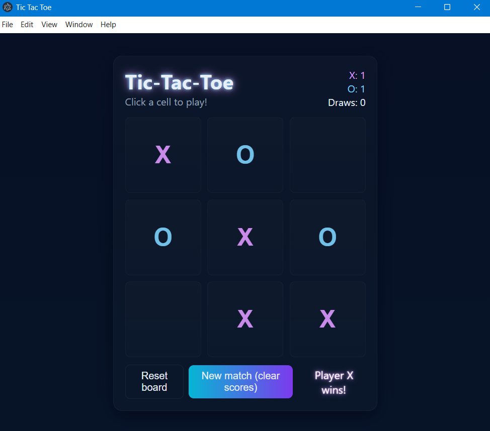

# 🕹 Tic-Tac-Toe 

A simple **Tic-Tac-Toe** game built with [Electron](https://www.electronjs.org/).  
Play locally on your desktop — works on Windows, macOS, and Linux.

## 🌐 Live Demo

Check out the live site here: [https://bianca574.github.io/tic-tac-toe-app/]

## 🛠️ Technologies Used

- HTML
- CSS
- JavaScript

## 📸 Screenshot

## ✨ Features

- 🎮 Classic Tic-Tac-Toe gameplay  
- 🖥 Cross-platform desktop app  
- 🎨 Clean and simple UI  
- ⚡ Fast and lightweight  

## 📦 Installation

First, clone this repository:

git clone https://github.com/bianca574/tic-tac-toe-app.git

cd tic-tac-toe-app

Then install dependencies:

npm install

🚀 Run in Development

npm start

This will open the app in an Electron window for development.

🛠 Build for Production

To create a distributable package:

npm run make

The output will be in the out/ or dist/ folder (depending on your config).

## 📄 License

This project is closed-source. All rights reserved.
